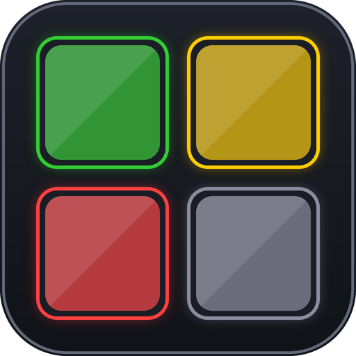

  

# ExpansionGlow

Every item in your bags and bank gets a colour based on how many expansions old
it is, so you can tell current-expansion loot from leftover clutter without
opening a single tooltip.

## How items are graded

Items are sorted into four tiers, measured against whatever the current
expansion happens to be:

| Tier | Default colour |
|------|----------------|
| One expansion back | Green |
| Two expansions back | Amber |
| Three expansions back | Red |
| Four or more expansions back | Grey |

Current-expansion items are left unmarked. Your bags stay quiet, and only the
older items draw the eye.

Because the tiers are worked out relative to the live expansion rather than
being hardcoded, everything re-grades itself the day a new expansion launches.
Nothing to update, nothing to reset.

## Or one colour per expansion

If four tiers is too coarse, switch to per-expansion colouring and every past
expansion gets its own colour instead. Battle for Azeroth, Legion, Warlords and
everything older stop sharing the single "ancient" colour and become
individually identifiable.

The list builds itself from the expansions the client knows about, using the
game's own localised expansion names, so it grows on its own as new ones ship.
Current-expansion items stay unmarked either way.

**One caveat worth knowing before you rely on it.** The game reports no
expansion at all for a large number of items, and those are indistinguishable
from genuine Classic items — both arrive as expansion `0`. In tier mode they
land under "four or more expansions back", which is at least vaguely true. In
per-expansion mode they land under *Classic* specifically, which is a much more
concrete claim than the data supports. The options panel says so next to the
list, and you can switch that one colour off if it turns out to be noisy.

## Two styles

- **Tint** (default) — washes the item icon with the tier colour.
- **Outline** — draws a coloured border around the slot and leaves the icon
  completely untouched.

## Options

An in-game panel under Escape → Options → AddOns → ExpansionGlow, or `/expglow`:

- pick between age tiers and per-expansion colouring
- a colour picker for every tier and every expansion
- tint opacity
- outline width and distance from the slot
- switch any individual tier or expansion off
- reset to defaults

The panel shows the controls that apply to what you have selected, so the
expansion list and the outline sliders appear only when they do something.

### Slash commands

| Command | Effect |
|---------|--------|
| `/expglow` | open the options panel |
| `/expglow status` | print current settings |
| `/expglow toggle` | all markers on or off |
| `/expglow prev1\|prev2\|prev3\|ancient` | toggle that tier |
| `/expglow prev1\|prev2\|prev3\|ancient <hex>` | set that tier's colour, e.g. `33cc33` |
| `/expglow mode age\|expansion` | four age tiers, or one colour per expansion |
| `/expglow style tint\|border` | colour the icon, or outline the slot |
| `/expglow alpha <0-1>` | tint strength |
| `/expglow thickness <0-10>` | outline width in pixels |
| `/expglow outset <0-10>` | outline distance outside the slot |
| `/expglow purge` | clear the cached item expansions |

## Where it works

- the default bags, both separate and combined
- the character bank and the warband bank
- [Baganator](https://www.curseforge.com/wow/addons/baganator)
- other bag addons that build on Blizzard's item buttons

## Built to stay out of the way

ExpansionGlow draws only textures it creates itself. It never touches the item
quality border, upgrade arrows, the new-item flash, search overlays, or corner
widgets belonging to other addons. The tint is drawn above the icon art but
underneath the quality border, item overlays and the stack count, so nothing
already on your item buttons gets covered up.

Each item's expansion is looked up once and remembered between sessions, so
opening your bags does not re-query the client for items it has already seen.
The stored value is the item's expansion, not its tier, so the cache stays
correct across an expansion launch.

## A note on untagged items

Blizzard leaves a large number of items with no expansion tag at all. In tier
mode those read as "four or more expansions back"; in per-expansion mode they
are lumped in with Classic, since the game reports the same value for both. If
that ends up noisier than you want, switch the affected colour off and the rest
keep working.

## Installation

Drop the `ExpansionGlow` folder into `World of Warcraft/_retail_/Interface/AddOns/`.

## Licence

All rights reserved. See [LICENSE](LICENSE).
